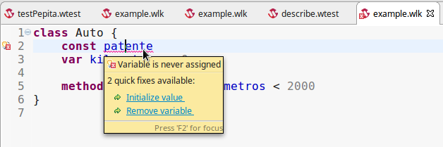

# Clase, builders y herencia

por Fernando Dodino - Agosto 2017
Distribuido con licencia [Creative commons Share-a-like](https://creativecommons.org/licenses/by-sa/4.0/legalcode)

## Repaso clases y objetos

19:00 - 20:30 Fer

Arrancamos repasando la diferencia entre objeto y clase.
¿Cuándo usar objetos anónimos, cuándo usar wko y cuándo clase?

- los **objetos anónimos** tienen un alcance acotado, por ejemplo un test, o la resolución de un requerimiento (un método y todo el encadenamiento de mensajes que sale de ese método). En el ejemplo de los taxistas construíamos pasajeros cuyo ciclo de vida era corto. Lo mismo pasa cuando evaluamos filter, o map de una colección: el objeto que representa al bloque no tiene nombre y no nos importa que lo tenga, existe para resolver el requerimiento puntual.

```xtend
method taxistasBuenos() = taxistas.filter { taxista => taxista.esBueno() } 
// las llaves encierran un objeto anónimo que representa el criterio
// de selección de un taxista
```

- **wko**: son objetos conocidos, porque están representando un concepto de negocio dentro de la aplicación. Esto ocurre cuando un objeto tiene un comportamiento específico, y nos interesa modelarlo en forma separada de otros objetos. El concepto de clase es muy útil pero si un lenguaje solo provee el mecanismo de instanciación con objetos se produce a) un sobrediseño (construimos una clase cuando pensamos en un solo objeto), b) toda una burocracia de crear la clase para luego instanciar un objeto y nada más.

- por último, las **clases** son importantes cuando se que existen múltiples objetos que comparten comportamiento y no tiene sentido que los nombre por separado: el viaje que hice ayer en colectivo, se parece mucho al viaje de la semana pasada. Si solo difieren en la información que guardan las referencias, el comportamiento se debe ubicar en un solo lugar para no repetir código. 

## Ojo cuando un método devuelve un bloque

Volviendo al tema de los objetos anónimos, fíjense lo que pasa cuando definimos un método así:

```scala
object pepita {
     var energia = 0
     method energia(_energia) = { energia = _energia }
}
```

El método energia(_energia) devuelve ... un bloque de código.
Entonces cuando ejecuten en el REPL:

```bash
>>> pepita.energia(2)
a Closure
```

Lo que les devuelve es un Closure, una lambda que lo que hace es:

```xtend
{ energia = 2 }
```

porque estamos enviando el mensaje energia(2). Es decir, **no ejecuta el código** sino que genera código para que lo podamos ejecutar. Esto es algo muy poderoso, pero que no queremos en un setter.

## Formas de instanciar un objeto

Los objetos anónimos se creaban en forma programática:

```xtend
const alumno = object {
	method estudia() = true
}
```

Mientras que los wko se instanciaban solos en el momento en que uno ejecuta la consola REPL, o bien un test, o un programa.

También están los literales de Wollok: objetos que tienen una sintaxis propia para construirse:

```xtend
2        // permite referenciar al número 2
"hola"   // construye un String cuyo valor es "hola"
[7]      // construye una lista con un único elemento: el número 7
```

¿Cómo instanciamos una fecha?

```xtend
>>> new Date()
```

Pero también podemos instanciarlo con valores:

```xtend
>>> new Date(17, 8, 2017)
```

## Introducción a Constructores

Para poder crear una instancia de una clase, necesitamos que esa clase defina al menos un **constructor**, un mecanismo que nos dice qué debe ocurrir cuando inicializamos un objeto.

Por defecto, cuando creamos una clase no debemos escribir ningún constructor, porque viene "de fábrica" con un constructor sin parámetros. Entonces al ver este código

```xtend
class Auto {
	var patente
	var kilometros = 0

	method esNuevo() = kilometros < 2000
}
```

yo se que puedo crear un auto en la consola de esta manera:

```xtend
>>> const fierrito = new Auto()
```

Pero la patente es una referencia que debería ser constante, al fin y al cabo si no hay nada raro acompaña al auto en todo su ciclo de vida. Entonces cambiamos la definición de var a const:

```xtend
class Auto {
	const patente
	var kilometros = 0

	method esNuevo() = kilometros < 2000
}
```

Pero ahora nuestra clase Auto no compila. 



Debemos inicializar la referencia "patente". El problema es que si escribimos un valor para patente, será un valor compartido para todos los autos.

## Constructores específicos

Escribiremos entonces un constructor específico para autos: para instanciar un auto necesitamos pasarle la patente:

```xtend
class Auto {
	const patente
	var kilometros = 0

	constructor(_patente) {
		patente = _patente
	}

	method esNuevo() = kilometros < 2000
}
```

También podríamos inicializar los kilómetros del auto en el constructor:


```xtend
class Auto {
	const patente
	var kilometros

	constructor(_patente) {
		patente = _patente
		kilometros = 0
	}

	method esNuevo() = kilometros < 2000
}
```

Mientras no definamos más constructores, no hay diferencia en inicializar en un lugar u otro. Si escribimos más constructores, es más cómodo dejarlo como estaba antes...

Entonces en la consola REPL para poder crear un auto necesitaremos pasarle la patente:

```xtend
>>> new Auto()
ERROR: Wrong number of arguments. Should be new Auto(_patente) (line: 1)
>>> new Auto(2, "hola")
ERROR: Wrong number of arguments. Should be new Auto(_patente) (line: 1)
>>> new Auto("RVM363")
a Auto[patente=RVM363, kilometros=0]
```

Lo bueno es que nos avisa cuando nos faltan o nos sobran parámetros. Y como vemos, el constructor "por defecto" deja de ser válido cuando construimos nuestros propios constructores.

## Agregando constructores

Como dijimos antes medio al pasar, se pueden crear constructores adicionales. Por ejemplo, podríamos instanciar un auto con una patente y un kilometraje específico:

```xtend
>>> new Auto("RVM363")
a Auto[patente=RVM363, kilometros=0]
>>> new Auto("RVM363", 180000)
a Auto[patente=RVM363, kilometros=180000]
```

Esto se logra de la siguiente manera:

```xtend
class Auto {
	const patente
	var kilometros = 0

	constructor(_patente) {
		patente = _patente
	}

	constructor(_patente, _kilometros) {
		patente = _patente
		kilometros = _kilometros
	}
	
	method esNuevo() = kilometros < 2000
}
```

La pregunta que el lector podría hacerse es: ¿qué pasa si tengo un objeto con muchas referencias? ¿debo crear tantos constructores como referencias tenga?

## El caso de estudio: un viaje

Consideremos que un viaje tiene

- un chofer
- un auto
- un pasajero
- los kilómetros recorridos
- el costo
- la fecha del viaje

Podríamos pensar en un objeto **inmutable**, es decir que nuestro viaje se debería construir y no modificarse a lo largo de su ciclo de vida. Pero vamos a permitirnos una licencia, y dejar referencias variables...

```xtend
class Viaje {
	var chofer
	var auto
	var pasajero
	var kilometros
	var costo
	var fecha

	constructor(_chofer, _auto, _pasajero, _kilometros, _costo, _fecha) {
		chofer = _chofer
		auto = _auto
		pasajero = _pasajero
		kilometros = _kilometros
		costo = _costo
		fecha = _fecha
	}	
}
```

Instanciar un viaje en un fixture no es algo simpático, son muchos parámetros y debemos estar atentos a ellos:

```xtend
describe "tests de viajes" {

	const viajeACasanovas

	fixture {
		viajeACasanovas = new Viaje(daniel, peugeot404, susana, 5.9, 260, new Date())	
	}
```

Es fácil confundir el orden de los argumentos, más allá de que los parámetros tengan nombres representativos.

## Objetos que construyen objetos

Para ayudarnos a crear un viaje, vamos a pedirle a un objeto que lo construya. Es decir, vamos a definir un **Builder**.

Primero reemplazaremos el new Viaje() por un new ViajeBuilder()

```xtend
	fixture {
		viajeACasanovas = new ViajeBuilder(). ...	
```

El ViajeBuilder va a definir una responsabilidad para setear cada uno de los valores. Pero en lugar de utilizar un setter común, lo que nos obligaría a repetir una y otra vez el objeto receptor...

```xtend
	fixture {
		viajeACasanovas = new ViajeBuilder()
		viajeACasanovas.chofer(daniel)
		viajeACasanovas.pasajero(susana)
		... etc ...
```

... que sería lo mismo que hacerlo con el viaje, vamos a introducir un pequeño cambio: al asignar una referencia vamos a devolver el mismo ViajeBuilder. Esto permite encadenar los mensajes uno por uno:

```xtend
	fixture {
		viajeACasanovas = new ViajeBuilder()
			.chofer(daniel)
			.pasajero(susana)
			... etc ...
```

Y al final debería devolver el viaje propiamente dicho, para que la referencia viajeACasanovas apunte a un objeto viaje, y no a un ViajeBuilder:

```xtend
	fixture {
		viajeACasanovas = new ViajeBuilder()
			.chofer(daniel)
			.pasajero(susana)
			... etc ...
			.build()
```


## Implementación del Builder

Una opción es que el Builder tenga una referencia al viaje:

```xtend
class ViajeBuilder {

	const viaje
	
	constructor() {
		viaje = new Viaje()
	}
}
```

Claro, esto requiere que viaje tenga nuevamente un constructor por defecto. La otra opción es que el ViajeBuilder tenga referencias particulares:

```xtend
class ViajeBuilder {

	var chofer
	var pasajero
	... etc ...

	// no requiere constructor	
}
```

Cuando tenemos muchas referencias la segunda alternativa no solo es es un poco más incómoda sino que también produce repetición de código. Vamos entonces por la primera opción, generando un constructor vacío para Viaje.

## Ahora sí, la implementación de un Builder

```xtend
class ViajeBuilder {

	const viaje
	
	constructor() {
		viaje = new Viaje()
	}
	
	method chofer(_chofer) {
		viaje.chofer(_chofer)
		return self
	}

	method pasajero(_pasajero) {
		viaje.pasajero(_pasajero)
		return self
	}

	...

	method build() {
		return viaje
	}
	
}
```

Algunas observaciones

- cada setter devuelve además el objeto receptor, para poder encadenar los mensajes. Aquí vemos un ejemplo de un método que **si bien es acción, también está devolviendo valores**
- el lector puede sospechar que el ViajeBuilder no aporta ningún valor agregado a nuestra solución, ya que además debe implementar los setters de Viaje (que todavía no están definidos). Hasta ahora solo parece un *syntactic sugar*, pero el Builder provee dos funcionalidades interesantes:
	1. permite construir setters simplificados, como al ingresar una fecha
	2. el constructor puede inicializar valores diferentes al que tenga un viaje, para ciertas ocasiones específicas
	3. el método build() puede incorporar validaciones, para detectar inconsistencias en la creación de un viaje

Vemos la implementación final del Builder, con cada uno de los puntos

```xtend
class ViajeBuilder {

	const viaje
	
	constructor() {
		viaje = new Viaje()
		viaje.fecha(new Date())
	}
	
	method chofer(_chofer) {
		viaje.chofer(_chofer)
		return self
	}

	method pasajero(_pasajero) {
		viaje.pasajero(_pasajero)
		return self
	}

	// 2. Ingresamos una fecha con un setter específico
	method fecha(dia, mes, anio) {
		viaje.fecha(new Date(dia, mes, anio))
		return self
	}

	... más setters ...

	// 3. Agregamos validaciones en el build
	method build() {
		if (viaje.kilometros() <= 0) {
			self.error("Viaje: debe ingresar kilometraje")
		}
		if (viaje.costo() <= 0) {
			self.error("Viaje: debe ingresar el costo en $")
		}
		return viaje
	}
	
}

describe "tests de viajes" {

	const viajeACasanovas

	fixture {
		viajeACasanovas = new ViajeBuilder()
			.chofer(daniel)
			.pasajero(susana)
			.auto(peugeot404)
			.costo(260) // asignamos en el orden que queramos
			.kilometros(5.9)
			.build()
	}

	...
```

