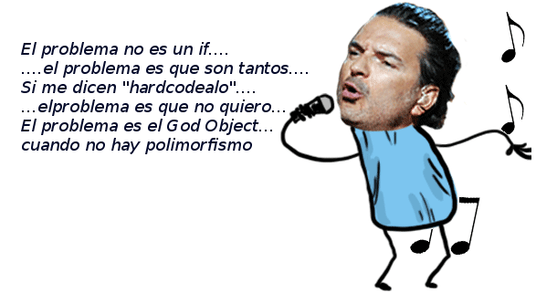

# Tamagotchi

## Introducción

Leemos bien el [enunciado](https://docs.google.com/document/d/1jLvvIVhdqvE8F7HOyfrOz_fpYe8L7NKWC_fDKYup_2I/edit)
y empezamos a buscar **objetos candidatos**, es decir, qué objetos podrían servirnos para
resolver los requerimientos.

Esto dependerá de las respuestas, podemos imaginar

- el tamagotchi
- *los estados* del tamagotchi
- alguno podría pensar en *las acciones* del tamagotchi, esto nos lleva a repasar la idea de modelar comportamiento como un objeto como una abstracción interesante y como concepto equivalente al de *orden superior* de funcional y lógico

## Servicios de un tamagotchi

El primer impulso es sentarse a codificar el tamagotchi, o modelar en un diagrama estático que un Tamagotchi tiene felicidad. Bajemos un cambio y pensemos en cómo queremos usar el Tamagotchi, qué cosas sabe hacer:

- comer
- jugar solo
- jugar con alguien

Alguien podrá pensar: "Ah, jugar podría ser un solo método, y le pasamos con quién juega. Si es *null* quiere jugar solo". Ok, pero eso *esconde* o **no revela** la intención de estar jugando solo. Son dos conceptos diferentes, entonces está bueno pensar en que tengo dos formas diferentes de jugar en mi sistema.

## Estados como objeto

- Si al comer tenemos que estar preguntando por el estado....
- ...pero también al jugar solo...
- ...y una vez más al jugar con alguien...

...eso significa que estamos necesitando diferenciar los estados, porque **cada estado tiene diferente comportamiento**.

Como dice nuestro amigo guatemalteco:



## Un poco de código no viene mal...

Ahora sí podemos comenzar a codificar el método **comer** del Tamagotchi. ¿Es un wko o una clase? Si vamos a jugar con otros tamagotchi, la pregunta que se impone es: ¿tienen diferente comportamiento o todos funcionan igual, más allá de la felicidad que cada uno tenga?

```javascript
class Tamagotchi {

	method comer() {
        (...)
	}	
	
}
```

Aquí se ve que para resolver esta responsabilidad necesita saber en qué estado está

- si está hambriento se pone contento
- si está contento...
- si está triste desde hace más de un día...

Si *reificamos* el estado, es decir, si el estado se compone de objetos con comportamiento y además son **polimórficos**, el método comer() de Tamagotchi se resuelve simplemente delegando a los estados y ya:

```javascript
class Tamagotchi {

	var estado = ...
	
	method comer() {
		estado.comer()		
	}	
	
}
```

## Estado inicial y estado con estado

¿Cuál será el estado inicial? El enunciado no lo dice, entonces como ingenieros debemos disparar la pregunta al usuario, no tomar la decisión por él.

Supongamos que el usuario nos dice: "contento es el estado inicial". Nuevamente tenemos que preguntarnos si el estado contento estará relacionado con el tamagotchi o no, de eso dependerá de que tenga estado. Es decir, un estado *con estado*, con referencias, de manera que necesitaremos diferenciar el estado contento del tamagotchi éste, y el estado contento del tamagotchi aquel.

En este momento y por motivos didácticos, vamos a elegir tener un estado propio para cada tamagotchi. Entonces al inicializar el estado contento, queremos pasarle la propia referencia:

```javascript
class Contento {
	var duenio
	
	constructor(_duenio) {
		duenio = _duenio
	}
}

class Tamagotchi {

	var estado = new Contento(self)
(...)
```

## A comer contentos

Cuando estamos contentos, el nivel de felicidad del tamagotchi aumenta en uno... entonces 

- no vamos a preguntar el nivel de felicidad del tamagotchi desde el estado
- sino que directamente vamos a darle la orden de ponerse más feliz al tamagotchi

```javascript
class Contento {
(...)

	method comer() {
		duenio.ponerseMasFeliz(1)
	}
```

Fíjense que recién ahora vamos a implementar la felicidad del tamagotchi (en realidad, después de haber escrito el método ponerseMasFeliz):

```javascript
class Tamagotchi {
	var felicidad = 0
(...)

	method ponerseMasFeliz(cuanto) {
		felicidad += cuanto
	}	
```

## Nuestro primer test

Para testear, vamos a 

- iniciar un tamagotchi con felicidad = 0
- le pedimos que coma
- la felicidad debe estar en 1

Necesitamos agregar un getter de la felicidad, y este test:

```javascript
import tamagotchi.*

describe "tests del tamagotchi" {
	var tamagotchiComun
	
	fixture {
		tamagotchiComun = new Tamagotchi()
	}
		
	test "comer estando contento" {
		assert.equals(0, tamagotchiComun.felicidad())
		tamagotchiComun.comer()
		assert.equals(1, tamagotchiComun.felicidad())
	}
}
```

El test pasa ok, buenísimo.

## Comer estando hambriento

Cuando come el tamagotchi, si está hambriento se pone contento. Esto implica un cambio de estado en el tamagotchi (el famoso efecto colateral). Pero en lugar de ofrecer un setter de estado vamos a construir un método ponerseContento().

```javascript
class Hambriento {
	var duenio
	
	constructor(_duenio) {
		duenio = _duenio
	}

	method comer() {
		duenio.ponerseContento()
	}
	
}

...

class Tamagotchi {
   	var estado = new Contento(self)
(...)

	method ponerseContento() {
		estado = new Contento(self)
	}	
}

```

Dos cosas que surgen:

- se empieza a repetir la idea de que cada estado tenga un dueño, y el constructor lo reciba
- en Tamagotchi ponerseContento() hace lo mismo que el inicializador de la referencia *estado*

Para el primer tema, aparece la superclase Estado, aunque no deja de hacer ruido que únicamente necesitamos reutilizar la estructura. En el segundo caso la referencia estado se inicializa delegando al método ponerseContento():

```javascript
class Estado {
	
	var duenio
	
	constructor(_duenio) {
		duenio = _duenio
	}
	
}

class Contento inherits Estado {
	method comer() {
		duenio.ponerseMasFeliz(1)
	}
}

class Hambriento inherits Estado{
	method comer() {
		duenio.ponerseContento()
	}
}

class Tamagotchi {

	var estado
	var felicidad = 0
	
	constructor() {
		self.ponerseContento()
	}
	
(...)

	method ponerseContento() {
		estado = new Contento(self)
	}	
}
```

El IDE nos advierte erróneamente sobre la referencia *estado* sin inicializar, ignorémoslo.


