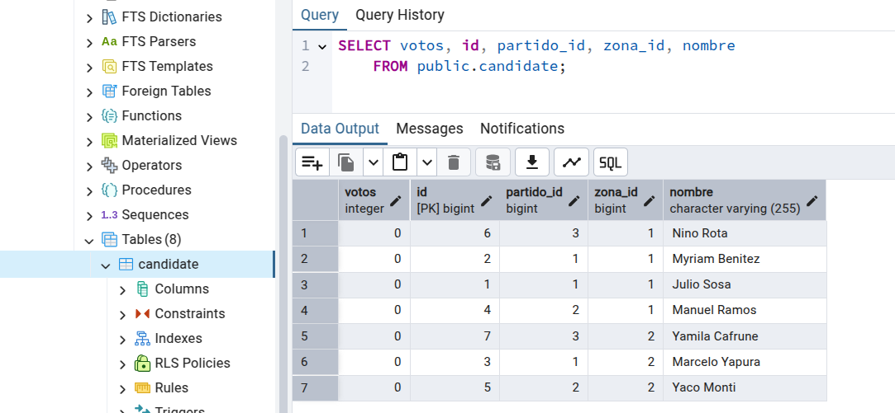

## Repaso

- Cómo es la arquitectura de Springboot: Controller - Service - Repository - objetos de dominio
- `@Autowire` es un mecanismo de inyección de dependencias, como los que vimos en Algoritmos 2: soporta inyección por setter, constructor y properties
- Por convención Spring Boot busca una clase que coincida con el tipo elegido, buscando en el mismo package/subpackages donde está la clase que tiene la anotación `@SpringbootApplication`
- Para más información vean [este artículo](https://www.baeldung.com/spring-autowire)
- Recordemos que es fundamental configurar el Open In View como falso en el `application.yml`

```yml
spring:
  ...

  jpa:
    open-in-view: false
```

### Services

- Service => @Transactional y @Transactional(readOnly=true), 
  - por qué va en el service => porque si lo ponés en el Repository no podés armar una transacción entre repos múltiples. Tip: los repos no necesariamente son todos de la misma base (e incluso pueden ser de distinto motor)
  - es importante diferenciar lo transaccional de lo que no (lo que solo devuelve vs. lo que actualiza) porque eso libera de carga al motor de la BD
  - @Transactional(rollbackFor = [Exception::class]) => las excepciones chequeadas por defecto no rollbackean la transacción. Ojo porque SQLException hereda de Exception.
  - qué pasa si hacemos @Transactional(rollbackFor = [Exception::class], readOnly = true) => ejecutamos la modificación, parece funcionar pero cuando ejecutamos la consulta vemos que no actualizó, el PATCH solo devolvió el valor que tenía en memoria

### Repositories

- definimos un

```kt
interface CandidateRepository : CrudRepository<Candidate, Long> {
```

donde el primer tipo es el que corresponde a los elementos que guardamos, el segundo corresponde al id.

- por qué es una interface? Porque no queremos escribir el código que mapea las queries, en lugar de eso utilizamos anotaciones...
- como EntityGraph:

```kt
interface CandidateRepository : CrudRepository<Candidate, Long> {
    @EntityGraph(attributePaths = ["partido", "promesas", "opiniones"])
    override fun findById(id: Long): Optional<Candidate>
}
```

en este caso definimos que cuando traemos un candidato queremos saber a qué partido pertenece, qué promesas hizo y las opiniones que tienen de esa persona. Eso define la estrategia de fetching, es decir cómo pasamos la información del medio persistente a memoria.

- hay otras anotaciones? Sí, las vamos a ver en breve

### Objetos de dominio: atributos, lazy/eager

- importante: todo objeto de dominio que se persiste debe tener la anotación @Entity
- si estamos en el modelo relacional, hay que tener una primary key, mediante la anotación @Id
- cada @Id define 4 posibles estrategias: `@GeneratedValue(strategy = GenerationType.Auto)` es la default donde JPA define el mecanismo en base al dialecto del motor. Podés usar IDENTITY para MySQL / SQLServer, lo mismo que SEQUENCE para PostgreSQL / Oracle. En estos dos casos el autoincremento lo resuelve la base de datos. Con TABLE para que se genere una tabla donde almacenamos el último número para cada entidad, o la SEQUENCE. Para más información podés ver [este sencillo artículo](https://medium.com/@bytewise010/spring-boot-identifiers-30454276449a).
- `@Column(length = 50)` lo usamos para `lateinit var descripcion: String` porque necesitamos definir la longitud. Probemos sacarle la anotación, y lo crea igual pero con una longitud de 255
- vemos la base, las relaciones que crea (zona_candidates, pareciera una many-to-many)
- si agregamos esta configuración

```kt
@OneToMany
@JoinColumn(name = "zona_id")          // <-- agregado
@JsonView(View.Zona.Detalle::class)
lateinit var candidates: MutableSet<Candidate>
```

fíjense cómo desaparece una tabla y tenemos la fk `zona_id` en la tabla de Candidatos:




- `@OneToMany`, el default es fetch LAZY. Recordemos que LAZY difiere la inicialización de nuestros objetos hasta que lo necesitemos la primera vez. Esto evita la hidratación innecesaria, por ejemplo cuando buscamos las zonas solo para mostrar en el combo los nombres y seleccionarlos mediante un identificador.
- Para profundizar, tienen [este artículo](https://www.baeldung.com/hibernate-lazy-eager-loading)

### Estrategias de Serialización

- Anotamos en el pizarrón: Anotaciones Jackson (`@JsonIgnore`, `@JsonProperty`) / DTO / Custom serializers / JsonView
- Para las zonas, fuimos por el DTO como primera medida. Hacemos una comparación

| Estrategia | Ventajas | Desventajas |
| -- | -- | -- |
| DTO | Fácil de definir con data class, no ensucia el código del objeto de dominio, permite controlar en detalle la serialización | Duplica la misma estructura solo para serializar, el objeto no tiene comportamiento y además es tedioso pasar la información atributo por atributo |
| `@JsonIgnore`, `@JsonProperty` | Permite configurar una forma por defecto para serializar | Agrega anotaciones al objeto de dominio |
| Custom Serializer | Es la que mayor control te da en la serialización, no solo para definir los atributos, sino el orden en el que los construís. Tampoco agrega anotaciones a tus objetos de dominio | Es una herramienta poco declarativa, necesitás escribir mucho y es tedioso hacerlo |
| JsonView | Permite definir declarativamente la profundidad en la serialización | Ensucia al objeto de dominio con múltiples anotaciones, si tenemos muchos casos de uso con serializaciones diferentes puede ser difícil de entender/mantener |

- La anotación `@JsonView` nos permite configurar la serialización:

```kt
@JsonView(View.Zona.Plana::class, View.Zona.Detalle::class)
    var id: Long? = null

    @Column(length = 50)
    @JsonView(View.Zona.Plana::class, View.Zona.Detalle::class)
    lateinit var descripcion: String

    @OneToMany
    @JsonView(View.Zona.Detalle::class)
    lateinit var candidates: MutableSet<Candidate>
```

Cada endpoint define una view para serializar a Json:

- getZonas trabaja con Zona.Plana
- getZona trabaja con Zona.Detalle

```kt
    @GetMapping("")
    @JsonView(View.Zona.Plana::class)
    fun getZonas(): Iterable<Zona> = zonaService.getZonas()

    @GetMapping("/{id}")
    @JsonView(View.Zona.Detalle::class)
    fun getZona(@PathVariable id: Long): Zona = zonaService.getZona(id)
```

### Herencia

- Nos metemos ahora en la herencia. Veamos la clase Partido:

```kt
@Entity
@JsonTypeInfo(use = JsonTypeInfo.Id.NAME, include = JsonTypeInfo.As.PROPERTY, property = "type")
@JsonSubTypes(
    JsonSubTypes.Type(value = Peronista::class, name = "PJ"),
    JsonSubTypes.Type(value = Preservativo::class, name = "PRE")
)
@Inheritance(strategy=InheritanceType.JOINED)
abstract class Partido {
  ...

@Entity
class Peronista : Partido() {
    var populista = false
}

@Entity
class Preservativo : Partido() {
```

- Pasamos de la estrategia JOINED a TABLE_PER_CLASS y finalmente a SINGLE_TABLE viendo cómo van quedando las tablas
- BONUS: en TABLE_PER_CLASS podemos actualizar un candidato para que apunte a un partido inexistente y vemos que rompe toda la app

### Relación de entidades en cascada

- [Relación de entidades en cascada](https://docs.google.com/presentation/d/1E98RwwsvAKuvs05X4OinwhdBgNwtHlbWoiHlEqJBr5c/edit?usp=sharing)

### Testeo de integración

- Para configurar la base de testing usamos un archivo `application.yml` gemelo pero en `src/test/resources`
  - la información que esté en la carpeta de test pisa lo que tenga `src/main/resources`
  - lo que esté en `src/main/resources` que no esté en test sí vale (ojo con eso)
- ¿Base de datos in memory o base de datos posta? Hay opiniones fuertes, sobre todo [a favor de no usar in-memory databases](https://phauer.com/2017/dont-use-in-memory-databases-tests-h2/) pero...
  - podemos ir por una estrategia híbrida quizás: testear localmente con H2 (una base de datos en memoria), lo que nos da mayor rapidez
  - y usar una base de datos real para testear el CI
  - si vamos por la opción de testear con una base de datos de verdad, está bueno usar una base de datos dedicada
  - el ejemplo de politics no es 100% recomendable => está usando el mismo juego de datos que el que crea el Bootstrap. Lo ideal es que definamos nuestro juego de datos por separado.

### MockMvc

Veamos un ejemplo:

```kt
@SpringBootTest
@AutoConfigureMockMvc
@DisplayName("Dado un controller de zonas")
class ZonaControllerTest {
    private val mapper = jacksonObjectMapper()

    @Autowired
    lateinit var mockMvc: MockMvc

    @Autowired
    lateinit var repoZonas: ZonaRepository

    @Test
    fun `las zonas solo traen los datos de primer nivel`() {
        val responseEntity = mockMvc.perform(MockMvcRequestBuilders.get("/zonas")).andReturn().response
        val zonas = mapper.readValue<List<Zona>>(responseEntity.contentAsString)
        assertEquals(200, responseEntity.status)
        assertEquals(2, zonas.size)
        // los zonas no traen candidatos
        assertThrows<UninitializedPropertyAccessException> { zonas.first().candidates }
    }

    @Test
    @DisplayName("no podemos traer información de una zona inexistente")
    fun profesorInexistente() {
        val responseEntity = mockMvc.perform(MockMvcRequestBuilders.get("/profesores/100")).andReturn().response
        assertEquals(404, responseEntity.status)
    }

}
```

- `@SpringBootTest` => se anotan los tests
- `@AutoConfigureMockMvc` => permite usar MockMvc que es un wrapper para nuestros tests con el que simulamos pedidos get, put, patch, post, delete, etc.
- eso permite testear la interfaz de nuestros controllers usando JSON
- en estos ejemplos usamos un `mapper` de Jackson para volver a deserializar la respuesta de MockMvc y trabajar con objetos
- testeamos 404, 500, 200...

### Otra variante

```kt
@Test
fun `si buscamos un candidate existente, recibimos el candidate`() {
    val candidate = getCandidateDePrueba()
    mockMvc.perform(
        MockMvcRequestBuilders.get("/candidates/" + candidate.id)
            .contentType(MediaType.APPLICATION_JSON)
    )
    .andExpect(status().isOk)
    .andExpect(content().contentType("application/json"))
    .andExpect(jsonPath("$.nombre").value(CANDIDATE_NOMBRE))
}
```

- en lugar de usar un mapper trabajamos con jsonpath, eso nos permite hacer queries directos contra la respuesta en JSON de mockMvc
- para practicar, pueden usar [JSON Path](https://jsonpath.com/), por ejemplo `$.phoneNumbers[:1].type`